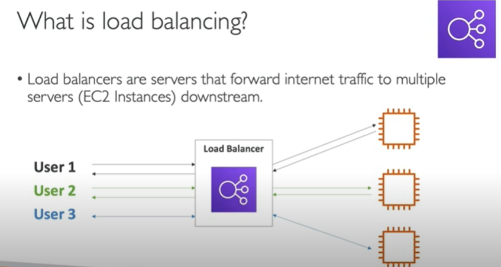
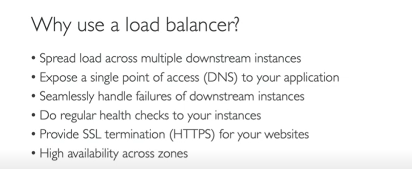

### ALB(Application Load Balancer)

- create two or more than two instance but of different regions
- crestr a http load balancer
```text
- give name of load balncer i.e. DemoALB
- select all availability zones
- create new security group
- add configure name i.e. demo-tg
- select the instances in which you want to establosh ALB
- then click on registered
- created ALB

- copy the dns and paste in browser see difference
```

<details>
<summary>1.</summary>



</details>
<details>
<summary>2.</summary>



</details>