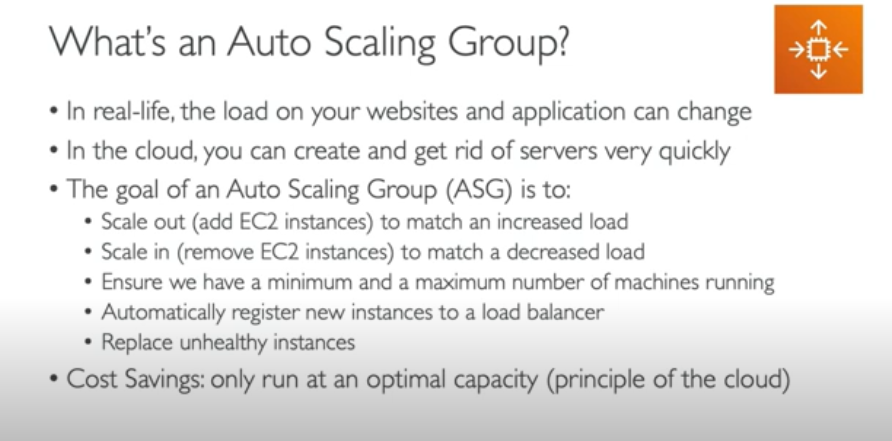
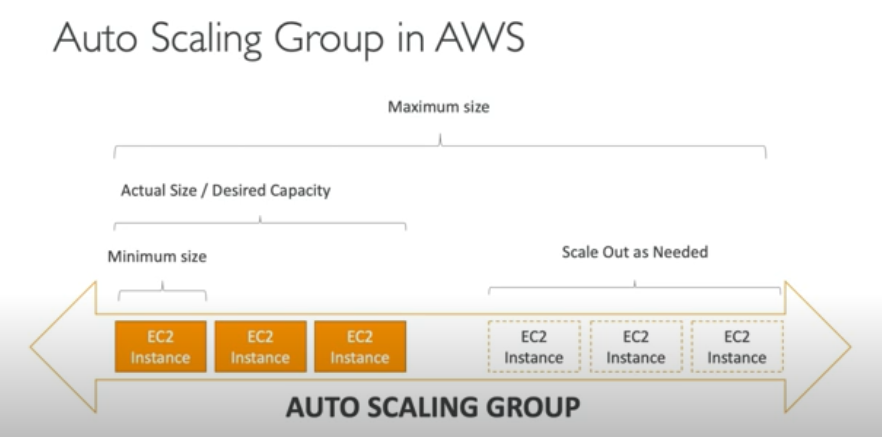
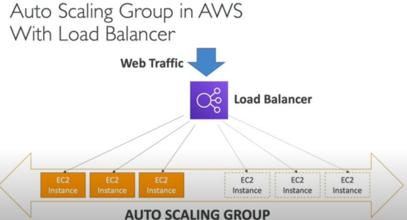

### ASG (Auto Scaling Group)
```text
- goto auto scaling group
- create ASG
- give name as i.e. MyTemplate
- create Template as for instances we created
  - in advance setting> in data> paste a code as we pasted in instances
- create all subnets in a region
-  
```


