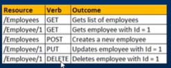

- ASP.NET Web API
```
- it is a framework for building Web API's, i.e. HTTP service on the top of the .NET framwork
- used for building rest full service web api
- these web api can be consumed by a broad range of clients like
  * Browsers
  * Mobile Applications
  * Desktop Applications
  * IOTs
```
- Rest full services
```
> stands for Representational State Transfer
> It is an architectural pattern for creating services
> rest is an architectural pattern specifies a set of constraints that a system should adhere to
```
- REST Constraints
```
> Client Server
> Stateless
> Cacheable
> Uniform Interface
> Layered Systems
> Code on demand
```


- When to use WCF over ASP.NET Web API
```
> Creating services that are transport/protocol independent. Single services with multiple end points
> You have an existing soap services You must support but want to add REST to reach more clients
> .NET 3.5 limitation
```
